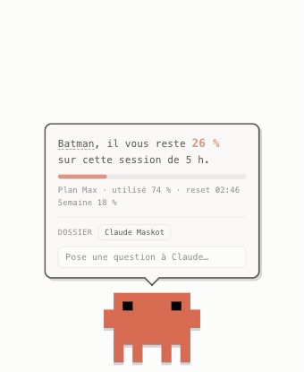
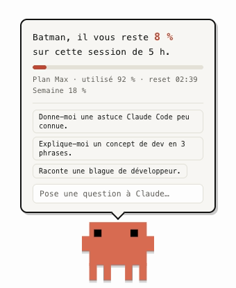
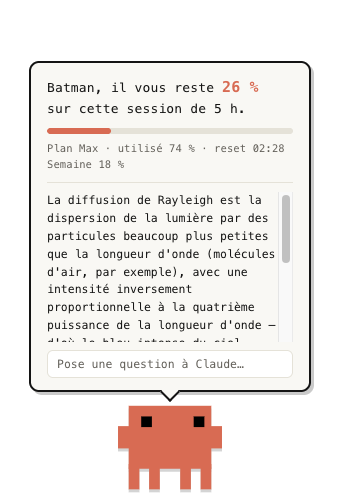
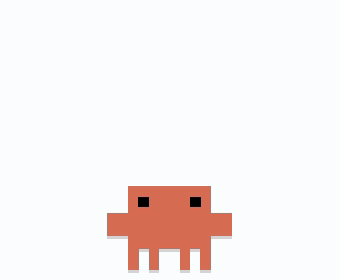
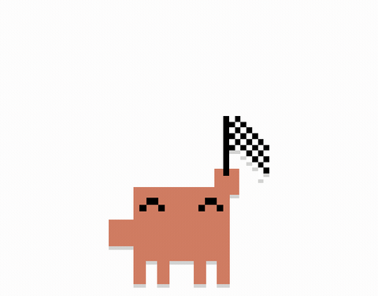
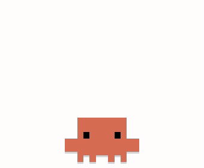
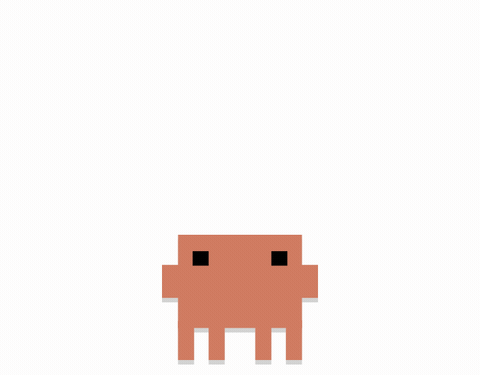
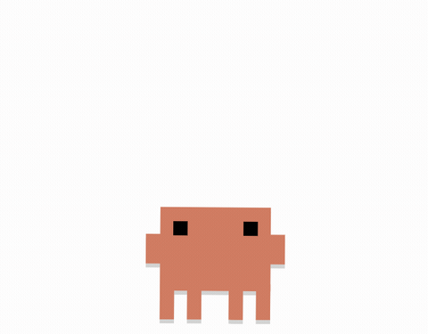
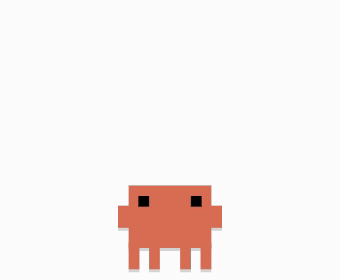
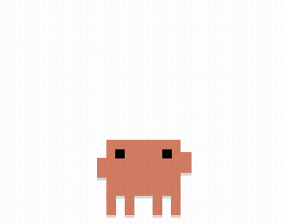

<div align="center">

# Claude Maskot

**Claude vit sur ton bureau et sait toujours où en est ta session Claude Code.**

macOS · Electron · GSAP · aucune clé API

<br />



<br />

*« Batman, il vous reste 26 % sur cette session de 5 h. »*

</div>

---

## Il fait quoi ?

Il affiche en direct l'état de ta session Claude Code (la fenêtre de 5 h), le même chiffre que la commande `/usage`, et il vit sa vie sur ton écran en attendant que tu le sollicites.

| Geste | Ce qui se passe |
|---|---|
| **Clic** | Il saute et ouvre la bulle : % restant, jauge, plan, heure de reset, % hebdo |
| **Écrire dans la bulle** | Tu lui poses une question et Claude répond, dans le dossier de ton choix |
| **Double-clic** | Une animation différente à chaque fois, en cycle |
| **Glisser** | Tu le poses où tu veux : il pendouille pendant le transport et la position est retenue |
| **Survol** | Ses yeux suivent ton curseur |
| **Clic droit** | Actualiser · jouer une animation · changer ton petit nom · ouvrir au démarrage · quitter |

Et sans rien lui demander :

- toutes les 30–75 s d'inactivité, il s'occupe (gym, boxe, dodo…)
- à **25 %** puis **10 %** restants, il t'alerte de lui-même : bulle + notification macOS
- quand la session se recharge, il fête ça en dansant
- sous 15 % restants, le chiffre et la jauge passent au rouge
- la fenêtre est **traversante en dehors de lui** : il ne bloque jamais tes clics

<div align="center">

</div>

## Pose-lui tes questions dans le dossier que tu veux

Un champ dans la bulle, et Claude qui répond. Le bouton **Dossier** choisit où Claude va chercher : « Général » pour une question libre, ou n'importe quel dossier de ta machine. Claude tourne alors dedans et peut lire le projet pour te répondre (« c'est quoi ce repo ? », « où est géré le login ? »…). Les cinq derniers dossiers restent à portée de clic.

Pendant qu'il attend la réponse, il prend sa pose pensive : yeux au ciel, balancement lent.

<div align="center">

</div>

Les réponses passent par `claude -p` : ton CLI Claude Code déjà connecté, donc **ton abonnement, zéro clé API, zéro config**.

### Et il t'appelle comme tu veux

Par défaut c'est « Batman ». Clique sur le nom dans la bulle (ou clic droit → **Comment il m'appelle…**) pour en changer : la bulle, les notifications **et les réponses de Claude** t'appelleront comme ça.

## La troupe

|  |  |  |
|:---:|:---:|:---:|
| **Gym** : 36 frames, bandeau inclus | **Drapeau** : lever à damier | **Marche** : 8 frames |
|  |  |  |
| **Boxe** : garde, jabs, uppercut | **Danse** : petits bonds | **Dodo** : bulles de sommeil |
|  | | |
| **Coucou** : il te salue | | |

Les flip-books (gym, drapeau, marche) sont les animations du mascot Claude reconstituées **rect par rect** par [Ayotomiwa Wale-Durojaye](https://tympanus.net/codrops/author/ayotomcs/) dans son article Codrops [*Reverse-Engineering Claude AI's Mascot Animations with SVG and GSAP*](https://tympanus.net/codrops/2026/05/05/reverse-engineering-claude-ais-mascot-animations-with-svg-and-gsap/) : frames et tempos exacts extraits de sa [démo](https://ayotomcs.me/claude-mascot), embarqués en local. Boxe, danse, coucou, dodo et la pose pensive sont des chorégraphies GSAP procédurales écrites dans le même esprit.

## Installation

Prérequis : macOS · [Claude Code](https://claude.com/claude-code) connecté (Pro/Max) · Node ≥ 20 · pnpm.

```bash
git clone https://github.com/SHN5906/claude-maskot.git
cd claude-maskot
pnpm install
pnpm start
```

Il apparaît en bas à droite. Pour le fermer : clic droit → **Quitter Claude Maskot** (pas de Dock ni de fenêtre, c'est un widget). Pour qu'il revienne tout seul : clic droit → **Ouvrir au démarrage de l'ordinateur**.

### Le lancer sans le terminal

Depuis la racine du repo, fabrique un wrapper `.app` qui pointe sur le binaire Electron du projet :

```bash
APP="/Applications/Claude Maskot.app"   # ou ~/Applications si tu n'es pas admin
mkdir -p "$APP/Contents/MacOS"
printf '#!/bin/sh\nexec "%s/node_modules/electron/dist/Electron.app/Contents/MacOS/Electron" "%s"\n' "$PWD" "$PWD" > "$APP/Contents/MacOS/launcher"
chmod +x "$APP/Contents/MacOS/launcher"
cat > "$APP/Contents/Info.plist" <<'EOF'
<?xml version="1.0" encoding="UTF-8"?>
<!DOCTYPE plist PUBLIC "-//Apple//DTD PLIST 1.0//EN" "http://www.apple.com/DTDs/PropertyList-1.0.dtd">
<plist version="1.0">
<dict>
  <key>CFBundleName</key><string>Claude Maskot</string>
  <key>CFBundleIdentifier</key><string>com.claude-maskot.launcher</string>
  <key>CFBundlePackageType</key><string>APPL</string>
  <key>CFBundleExecutable</key><string>launcher</string>
  <key>LSUIElement</key><true/>
</dict>
</plist>
EOF
```

« Claude Maskot » est ensuite dans Spotlight et `/Applications`, double-cliquable, épinglable au Dock. Le relancer alors qu'il tourne déjà ne fait rien : verrou single-instance. Le wrapper pointe en dur sur le dossier du repo, donc si tu déplaces le projet, refais la manip. Icône optionnelle : un `icon.icns` dans `Contents/Resources` plus la clé `CFBundleIconFile` → `icon` dans le plist.

## Comment il sait ? (et vie privée)

Le pourcentage vient du même endroit que `/usage` : l'endpoint OAuth officiel `https://api.anthropic.com/api/oauth/usage` (`five_hour.utilization`, `seven_day`, `limits`).

**Aucune clé ni token dans ce repo, ni dans une config.** Le token OAuth est lu à la volée dans le trousseau macOS (l'item « Claude Code-credentials » que Claude Code y range lui-même), gardé en mémoire le temps de la requête, jamais écrit ni loggé. Les seules sorties réseau : cet appel d'usage vers l'API d'Anthropic, et tes questions via le CLI `claude`. Rien d'autre.

Rafraîchissement toutes les 60 s + à l'ouverture de la bulle, avec throttle (l'API rate-limite vite) et conservation de la dernière valeur connue en cas de coupure.

## Bidouiller

Capturer la fenêtre sans permission Screen Recording, c'est comme ça que tous les visuels de ce README ont été faits :

```bash
# bulle ouverte (une image)
MASKOT_SHOT=/tmp/maskot.png pnpm start

# une animation en cours de lecture
MASKOT_SHOT=/tmp/boxe.png MASKOT_SHOT_PERF=boxe MASKOT_SHOT_AT=1200 pnpm start

# rafale de frames → GIF (ffmpeg)
MASKOT_SHOT=/tmp/frames/boxe MASKOT_SHOT_PERF=boxe MASKOT_SHOT_FRAMES=42 MASKOT_SHOT_EVERY=80 pnpm start

# une question posée automatiquement
MASKOT_SHOT=/tmp/ask.png MASKOT_SHOT_ASK="Pourquoi le ciel est bleu ?" MASKOT_SHOT_AT=18000 pnpm start

# données factices (tester sans l'API, ex. l'état critique)
MASKOT_SHOT_MOCK=92 pnpm start
```

| Fichier | Rôle |
|---|---|
| `src/main.js` | Fenêtre, trousseau, API d'usage, alertes, menus, dossier de contexte, CLI claude, démarrage auto |
| `src/renderer/mascot.js` | Le personnage et ses animations GSAP |
| `src/renderer/performances.js` | Flip-books + chorégraphies, planification idle |
| `src/renderer/sprites.js` | Frames SVG embarquées (généré depuis la démo Codrops) |
| `src/renderer/app.js` | Bulle, questions, petit nom, drag, clics |

## Crédits

- Design de la mascotte © [Anthropic](https://www.anthropic.com) (projet personnel, non affilié)
- Animations flip-book reconstituées par [Ayotomiwa Wale-Durojaye](https://ayotomcs.me/claude-mascot) ([article Codrops](https://tympanus.net/codrops/2026/05/05/reverse-engineering-claude-ais-mascot-animations-with-svg-and-gsap/))
- Animations propulsées par [GSAP](https://gsap.com)
