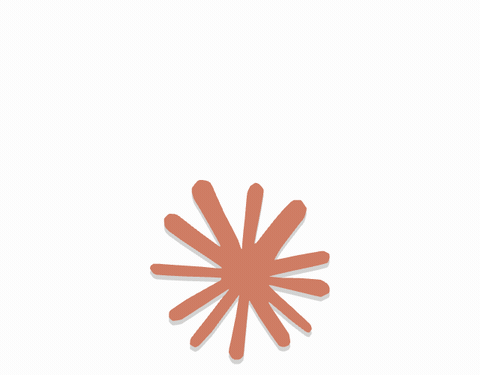

<div align="center">

# Claude Maskot

**La mascotte Claude sur ton bureau — elle sait toujours où en est ta session Claude Code.**


*Un clic : « Batman, il vous reste 26 % sur cette session de 5 h. »*

</div>

---

## C'est quoi ?

Un widget macOS (Electron + GSAP) qui pose la mascotte Claude en pixel-art sur ton écran, toujours au premier plan, et qui lit en direct la consommation de ta session Claude Code (la fenêtre de 5 h) :

- **Clic** → bulle avec le **% restant**, la jauge, le plan, l'heure de reset et le % hebdo
- **Double-clic** → une animation différente à chaque fois
- **Glisser** → tu la poses où tu veux (elle pendouille pendant le transport, position mémorisée)
- **Survol** → ses yeux suivent ton curseur ; au repos elle respire, cligne, regarde autour d'elle
- **Clic droit** → actualiser, choisir une animation, quitter
- Elle **alerte d'elle-même** quand il reste 25 % puis 10 % (bulle + notification macOS), et fait tourner l'étoile Claude quand la session se recharge
- La fenêtre est **traversante en dehors de la mascotte** : elle ne bloque jamais tes clics

Sous 15 % restants, tout passe au rouge :

<div align="center">

</div>

## La troupe

Laissée tranquille, elle s'occupe toutes les 30–75 s. En double-cliquant, tu fais défiler les numéros :

|  |  |  |
|:---:|:---:|:---:|
| **Gym** — 36 frames, bandeau inclus | **Drapeau** — lever à damier | **Marche** — 8 frames |
|  |  |  |
| **Boxe** — garde, jabs, uppercut | **Danse** — petits bonds | **Dodo** — avec bulles de sommeil |
|  |  | |
| **Coucou** — elle te salue | **Étoile Claude** — le spinner | |

Les flip-books (gym, drapeau, marche, étoile) sont les animations du mascot Claude reconstituées rect par rect par [Ayotomiwa Wale-Durojaye](https://tympanus.net/codrops/author/ayotomcs/) dans son article Codrops [Reverse-Engineering Claude AI's Mascot Animations with SVG and GSAP](https://tympanus.net/codrops/2026/05/05/reverse-engineering-claude-ais-mascot-animations-with-svg-and-gsap/) — frames et tempos exacts extraits de sa [démo](https://ayotomcs.me/claude-mascot), embarqués en local. Boxe, danse, coucou et dodo sont des chorégraphies GSAP procédurales écrites dans le même esprit.

## Installation

Prérequis : macOS, [Claude Code](https://claude.com/claude-code) connecté (Pro/Max), Node ≥ 20, pnpm.

```bash
git clone git@github.com:SHN5906/claude-maskot.git
cd claude-maskot
pnpm install
pnpm start
```

Pour la fermer : clic droit sur la mascotte → **Quitter**.

Lancement automatique à l'ouverture de session : voir [`docs`](#lancement-automatique-optionnel) plus bas.

## Fonctionnement & vie privée

Le pourcentage vient du même endroit que la commande `/usage` de Claude Code : l'endpoint OAuth officiel `https://api.anthropic.com/api/oauth/usage` (champs `five_hour.utilization`, `seven_day`, `limits`).

**Aucune clé ni token dans ce repo ni dans une config** : le token OAuth est lu à la volée dans le trousseau macOS (l'item « Claude Code-credentials » que Claude Code y range lui-même), et ne sert qu'à cet appel vers l'API d'Anthropic. Rien d'autre ne sort de ta machine.

Rafraîchissement toutes les 60 s + à l'ouverture de la bulle, avec throttle (l'API rate-limite vite) et conservation de la dernière valeur connue en cas de coupure.

## Dev

Capturer la fenêtre sans permission Screen Recording (c'est comme ça que les GIF de ce README ont été faits) :

```bash
# bulle ouverte (une image)
MASKOT_SHOT=/tmp/maskot.png pnpm start

# une animation en cours de lecture
MASKOT_SHOT=/tmp/boxe.png MASKOT_SHOT_PERF=boxe MASKOT_SHOT_AT=1200 pnpm start

# rafale de frames pour un GIF
MASKOT_SHOT=/tmp/frames/boxe MASKOT_SHOT_PERF=boxe MASKOT_SHOT_FRAMES=42 MASKOT_SHOT_EVERY=80 pnpm start

# données factices (pour tester sans l'API, ex. l'état critique)
MASKOT_SHOT_MOCK=92 pnpm start
```

Structure : `src/main.js` (fenêtre, trousseau, API, alertes) · `src/renderer/mascot.js` (le personnage et ses animations GSAP) · `src/renderer/performances.js` (flip-books + chorégraphies) · `src/renderer/sprites.js` (frames SVG embarquées) · `src/renderer/app.js` (bulle, drag, clics).

## Lancement automatique (optionnel)

```bash
cat > ~/Library/LaunchAgents/com.claude-maskot.plist <<'EOF'
<?xml version="1.0" encoding="UTF-8"?>
<!DOCTYPE plist PUBLIC "-//Apple//DTD PLIST 1.0//EN" "http://www.apple.com/DTDs/PropertyList-1.0.dtd">
<plist version="1.0"><dict>
  <key>Label</key><string>com.claude-maskot</string>
  <key>ProgramArguments</key><array>
    <string>/chemin/vers/claude-maskot/node_modules/.bin/electron</string>
    <string>/chemin/vers/claude-maskot</string>
  </array>
  <key>RunAtLoad</key><true/>
</dict></plist>
EOF
launchctl load ~/Library/LaunchAgents/com.claude-maskot.plist
```

## Crédits

- Design de la mascotte © [Anthropic](https://www.anthropic.com) — projet personnel non affilié
- Animations flip-book reconstituées par [Ayotomiwa Wale-Durojaye](https://ayotomcs.me/claude-mascot) ([article Codrops](https://tympanus.net/codrops/2026/05/05/reverse-engineering-claude-ais-mascot-animations-with-svg-and-gsap/))
- Animations propulsées par [GSAP](https://gsap.com)
